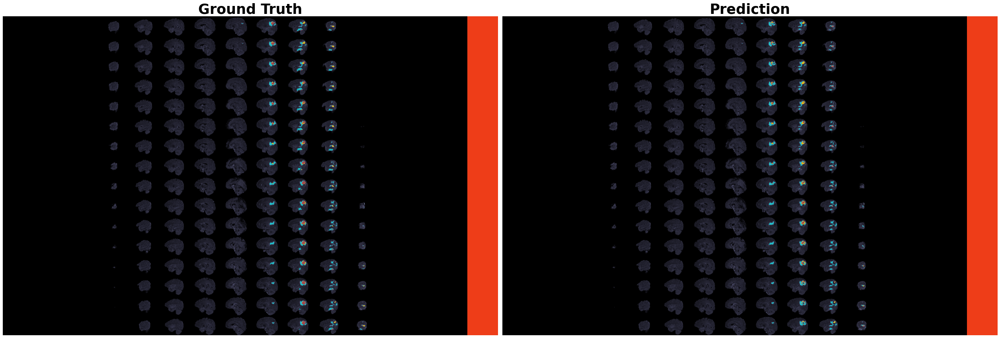

<h2 font-size:40px align="center">3D Brain Tumour Image Segmentation (BraTS 2020)</h2>

<h3 align="center">By Siddhant Bikram Shah</h3>
 

  

<h6 align="center">Ground Truths vs Predictions</h6>
 

This program uses a U-Net model for 3D brain tumor segmentation in multimodal MRI images from the BraTS2020 dataset. It uses a 3D autoencoder to extract representations from segmented images and feed this data to an SVR model to predict the age and number of days of survival of patients.

Thank you! If you have any questions, please feel free to reach out to siddhantshah3000@gmail.com
 
 

<b>References:</b>

1. B. H. Menze, A. Jakab, S. Bauer, J. Kalpathy-Cramer, K. Farahani, J. Kirby, et al. "The Multimodal Brain Tumor Image Segmentation Benchmark (BRATS)", IEEE Transactions on Medical Imaging 34(10), 1993-2024 (2015) DOI: 10.1109/TMI.2014.2377694 
2. S. Bakas, H. Akbari, A. Sotiras, M. Bilello, M. Rozycki, J.S. Kirby, et al., "Advancing The Cancer Genome Atlas glioma MRI collections with expert segmentation labels and radiomic features", Nature Scientific Data, 4:170117 (2017) DOI: 10.1038/sdata.2017.117
3. S. Bakas, M. Reyes, A. Jakab, S. Bauer, M. Rempfler, A. Crimi, et al., "Identifying the Best Machine Learning Algorithms for Brain Tumor Segmentation, Progression Assessment, and Overall Survival Prediction in the BRATS Challenge", arXiv preprint arXiv:1811.02629 (2018)
